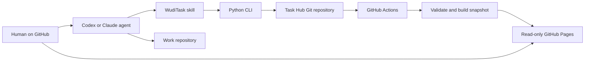

# 架构与并发模型

## 目标

WudiTask 解决的是“多个机器上的多个 agent 如何共享任务，并确保同一任务只有一个已确认领取者”。它有意不追求数据库级全局事务：冲突概率应通过一任务一文件降到很低；发生冲突时必须可检测、可重试、不得静默覆盖。

## 组件



### Task Hub

Task Hub 是唯一事实源，包含：

- `data/`：业务数据。
- `wuditask/` 与 `tools/wuditask.py`：同版本访问工具。
- `.agents/skills/`：agent 操作规程。
- `site/`：只读可视化源码。
- `.github/workflows/pages.yml`：校验、构建与部署。

工具与数据同仓保存，因此 clone 某个历史提交时，能同时得到理解该数据版本的代码。

### Work repository

工作仓库不保存 WudiTask 锁文件，也不需要安装 SDK。agent 在工作仓库中读取 origin，以 `owner/name` 匹配 Task Hub 中的任务，然后在该工作仓库完成代码与验证。

### GitHub Pages

Pages 是派生视图，不是写入 API。Actions 从已提交的 JSON 构建 `snapshot.json` 与静态资源；`_site` 只作为 artifact 上传，不提交回 Task Hub。即使 Pages 暂时不可用，CLI 与 Git 协议仍可运行。

## 普通 push 的乐观并发

每个远端写命令执行同一套事务：

1. 从 origin 当前分支创建临时 clone，得到新快照。
2. 在临时 clone 中重新检查 schema、owner、claim 和依赖。
3. 只修改目标任务文件。
4. 创建普通 Git commit。
5. 执行普通 `git push`，从不使用 `--force`。
6. push 成功后返回 `sync.confirmed=true`。
7. 如果因 non-fast-forward 被拒绝，丢弃临时 clone，从第 1 步重新开始。

```mermaid
sequenceDiagram
  participant A as Agent A
  participant B as Agent B
  participant O as Git origin
  A->>O: clone latest
  B->>O: clone latest
  A->>A: claim task T
  B->>B: claim task T
  A->>O: ordinary push
  O-->>A: accepted
  B->>O: ordinary push
  O-->>B: rejected, fetch first
  B->>O: clone latest and re-evaluate T
  O-->>B: T already has owner
  B-->>B: return claim_conflict; do not work
```

### Push 失败不总等于“没抢到”

non-fast-forward 只说明远端变了，可能是另一台机器修改了完全不同的任务。WudiTask 会自动重试：

- 若目标任务仍为空：重放本次修改并再次普通 push。
- 若目标任务已被他人领取：返回 `claim_conflict`，确认没有抢到。
- 若只是其他任务变化：通常第二次 push 会成功。
- 若网络、认证或服务端状态不明确：返回 `push_status_unknown`，fail closed；agent 不得开始工作，应重试同一命令确认远端状态。

因此真正的开工条件不是“本地 JSON 已改”或“第一次 push 没报错”，而是命令返回：

```json
{
  "ok": true,
  "confirmed": true,
  "sync": {
    "confirmed": true
  }
}
```

## 为什么一任务一文件

两个 agent 领取不同任务时会修改两个路径。第一次 push 后，第二次虽然会遇到 branch head 变化，但从新快照重放时不会产生内容冲突。只有同时操作同一个任务才会竞争同一路径与 claim 条件。

archive 是同一事务中的 rename：`data/open/<id>.json` 变为 `data/archive/<year>/<id>.json`。Git 历史保留完整轨迹。

## 原子性边界

系统不承诺：

- 跨 GitHub 仓库的原子提交。
- 工作仓库代码与 Task Hub archive 的两阶段提交。
- GitHub 服务不可达时的离线领取。
- 网络中断后立即知道 push 是否已被服务端接受。

系统承诺：

- 不 force-push。
- 未确认 claim 时 agent 不开工。
- 每次远端重试都重新检查目标任务，而不是盲目重放旧文本。
- archive done 必须有完整验收证据。
- failed/cancelled 不解除依赖。
- 数据格式、依赖图与 Pages 构建在 CI 中统一验证。

这是有意选择的低复杂度模型：允许极低概率、可见且可恢复的冲突，不引入常驻协调服务器。

## 分支配置

Task Hub 的默认分支应允许被授权参与者直接普通 push，因为 claim 的确认点就是该 push。推荐分支规则：

- 禁止 force push。
- 禁止删除默认分支。
- 限制谁可以 push。
- 启用 secret scanning 与审计（组织能力允许时）。
- 不要求每个 task claim 走 pull request。

如果组织策略强制所有修改通过 PR，则本协议不能提供低延迟唯一领取；应改用 GitHub Issues/Projects 的服务端原子 API 或专用协调服务。

## 可用性与隐私

Git origin 是协调面，短时不可用时所有新 claim fail closed；已经领取的工作可以继续，但 archive 要等远端恢复。

私有 Task Hub 可以用于限制 JSON 访问，但 Pages 的访问级别必须单独判断。一般私有源仓库发布的 Pages 仍是公网内容；只有支持 Pages 访问控制的 Enterprise Cloud 组织才应发布敏感任务。默认把 title、goal、context、owner 和 evidence 都视为会被 Pages 读者看到。
